# Greenwood-Library-Website

First Capstone Project
 This capstone project is to simulate the roles of two contributors: **"Morgan"** and **"Jamie"**. Morgan will be responsible for the **"Book Reviews"** section, while Jamie will handle the **"Update Events"** section.

## Objectives

- Demonstrate the ability to work collaboratively on a project. by practicing cloning a repository and working with branches in Git
- Gain experience in staging, committing, and pushing changes from both developers.
- Create pull requests and merge them after resolving any potential conflicts.

## Setup

1. I Created a new repository on GitHub called `greenwood-library-website`

_Here is the screen shot of the repository:_
 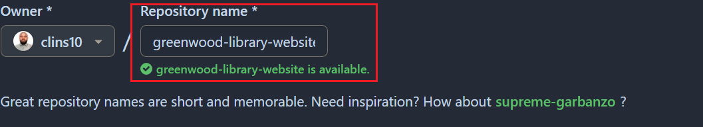

## Tasks

- I cloned the repository to my local machine using the command:

    ```bash git clone
       https://github.com/clins10/greenwood-library-website.git
    ```

    _screehnshot of the cloned repository:_
    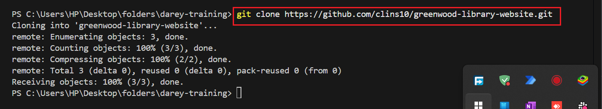

- Next I navigated to the cloned repository directory:

    ```bash
       cd greenwood-library-website
    ```

    And created the `.html` files in Main branch:
    `home.html`,
    `about.html`,
    `events.html`, and the
    `contact.html`.

    _screenshot of the created files:_
    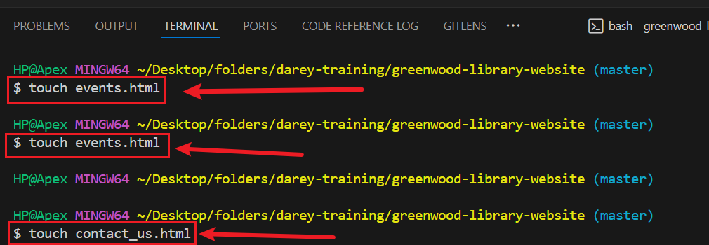

- I then added the files to the staging area using the command:

    ```bash
       git add .
    ```

    _screenshot of the staged files:_
    

- I committed the changes with a message:

    ```bash
       git commit -m ""
    ```

    _screenshot of the commit:_
    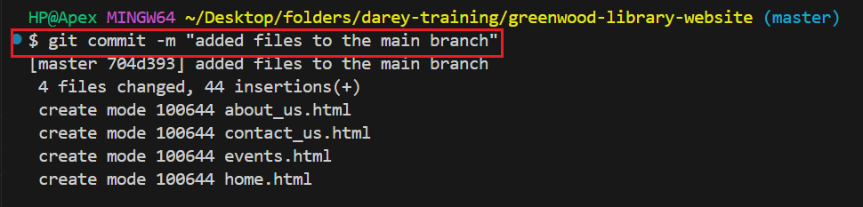

- After committing, I pushed the changes to the master branch on GitHub:

    ```bash
       git push origin master
    ```

    _screenshot of the pushed changes:_
    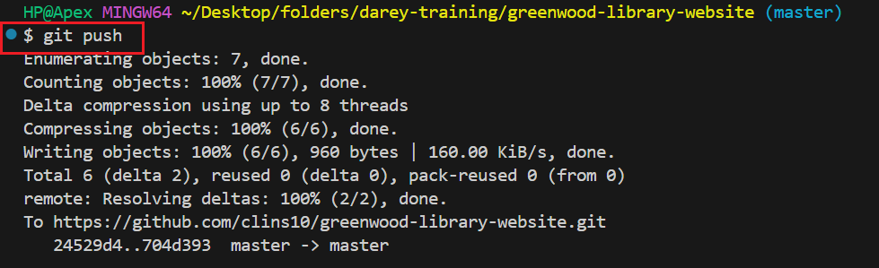

## Morgan's Tasks

- First I created and switched to a new branch called `add-book-review` for Morgan's work:

    ```bash
       git switch -c add-book-review
    ```

    _screenshot of the new branch created:_
    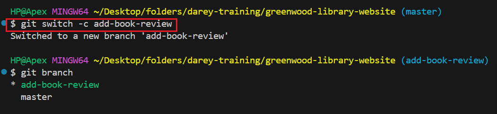

- Then I created a new file called `book-reviews.html` in the `add-book-review` branch:

    ```bash
       touch book-reviews.html
    ```

    _screenshot of the created file:_
    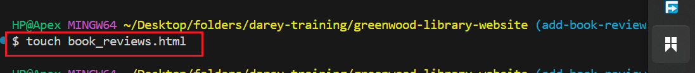

- Next I added the file to the staging area after adding content to it:

    ```bash
       git add book-reviews.html
    ```

- I committed the changes with a descriptive message:

    ```bash
       git commit -m "Add book reviews section to the morgan branch"
    ```

    _screenshot of the commit:_
    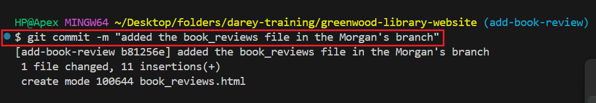

- Then pushed the changes to the `add-book-review` branch on GitHub:

    ```bash
       git push origin add-book-review
    ```

    _screenshot of the pushed changes in the Morgan's branch:_
    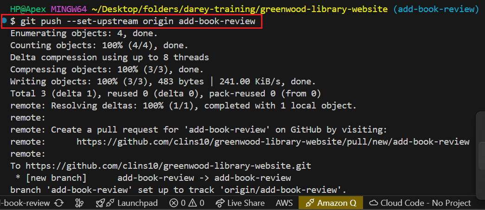
  
- I now moved to the GitHub repository page and created a pull request from the `add-book-review` branch to the `master` branch.
  
    _screenshot of the Morgan Branch and the pull request:_
    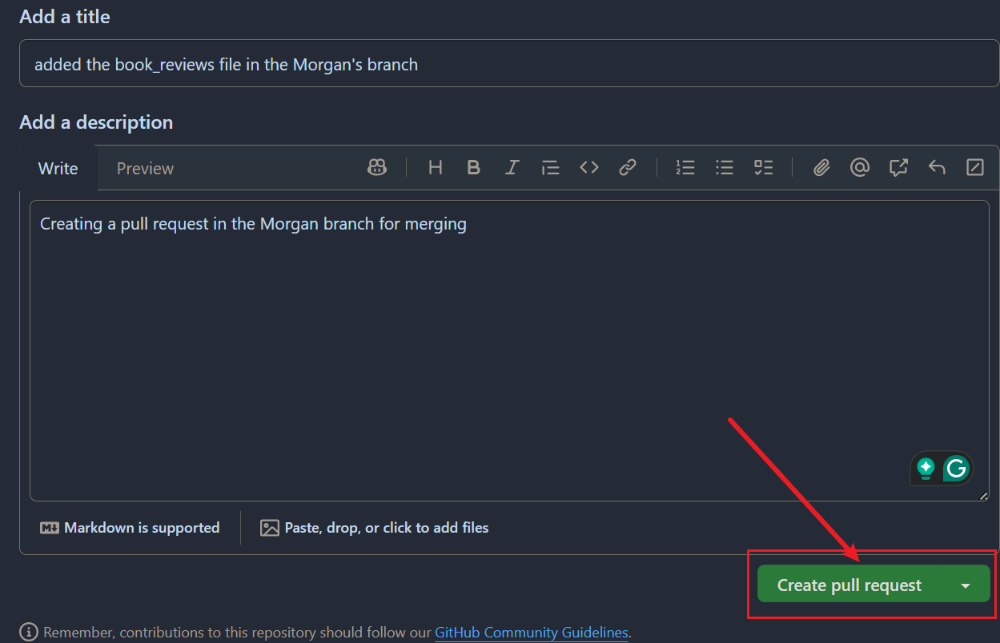

- I reviewed the changes and successfully merged the pull request into the `master` branch without conflicts.

    _screenshot of the merged pull request:_
    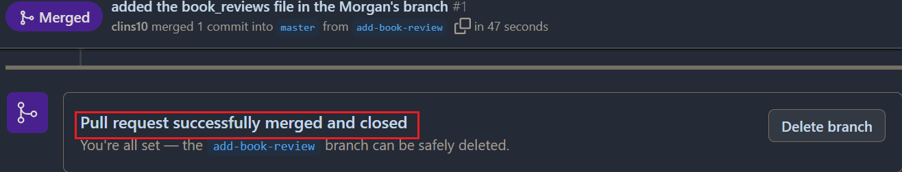

- After merging, I switched back to the `master` branch:

    ```bash
       git switch master
    ```

## Jamie's Tasks

- I created and switched to a new branch called `update-events` for Jamie's work:

    ```bash
       git switch -c update-events
    ```

    _screenshot of the new branch created:_
    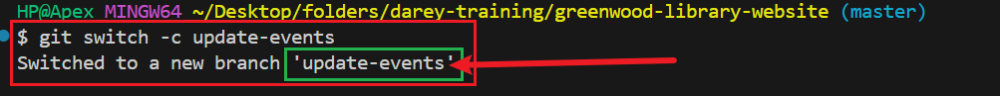

- I created a new file called `update_events.html` in the `update-events` branch
  _screenshot of the created file:_
  

- I added the changes made in the `update_events.html` file to the staging area:

    ```bash
       git add update_events.html
    ```

    _screenshot of the staged changes:_
    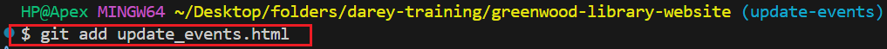

- I committed the changes with a meaningful commit message:

    ```bash
       git commit -m "Update events section in Jamie's branch"
    ```

    _screenshot of the commit:_
    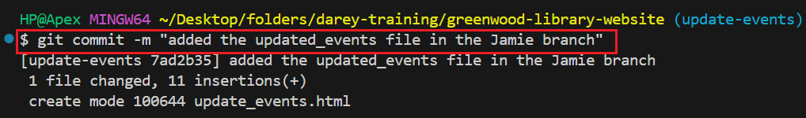

- I updated the Jamie's branch with the latest changes from the `master` branch to avoid conflicts:

    ```bash
       git pull origin master
       git switch update-events
    ```

- I pushed the changes to the `update-events` branch on GitHub:

    ```bash
       git push origin update-events
    ```

    _screenshot of the pushed changes:_
    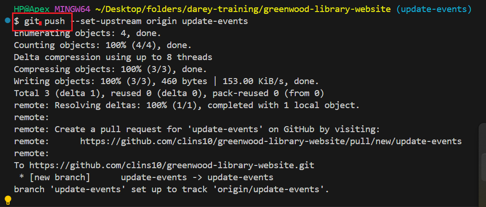

- I moved to the GitHub repository page and created a pull request from the `update-events` branch to the `master` branch.
  
    _screenshot of the Jamie Branch and the pull request:_
    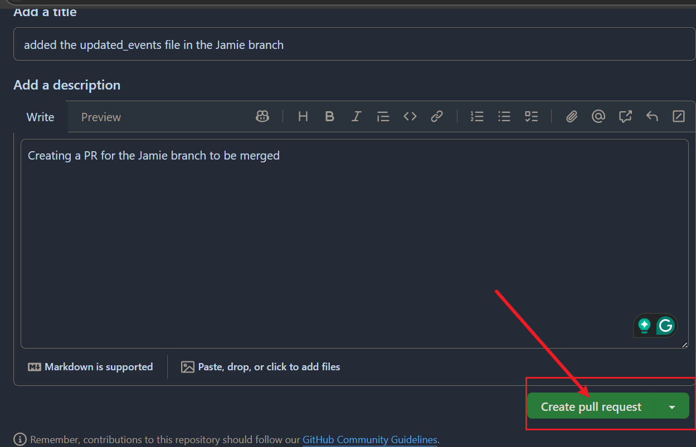

- I reviewed the changes made in the pull request and merged it into the `master` branch successfully without conflicts.
  _screenshot of the merged pull request:_
  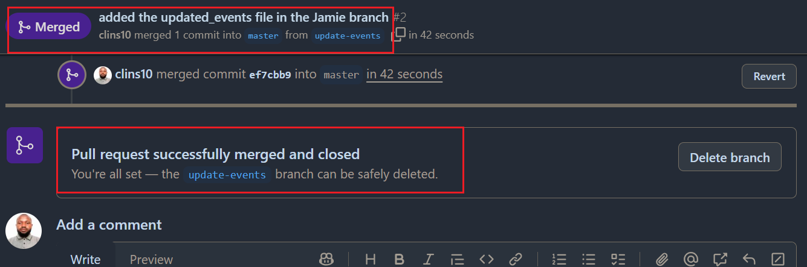

- After merging, I switched back to the `master` branch:

    ```bash
       git switch master
    ```
